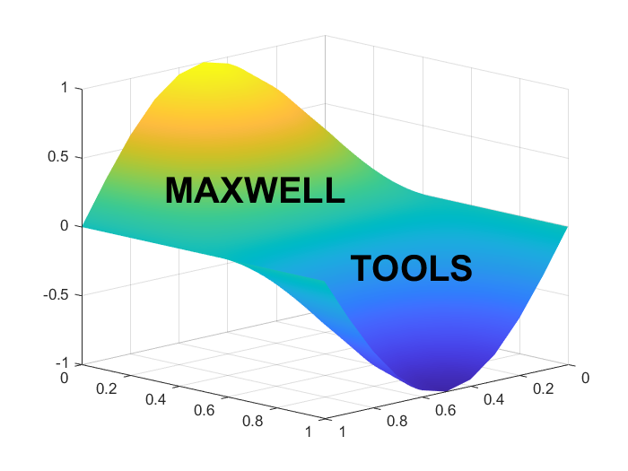

MATLAB Maxwell Tools is a library of custom functions to reduce the developement time for engineers. The current release includes conversions and automated figure formatting.

This is a work in progress...